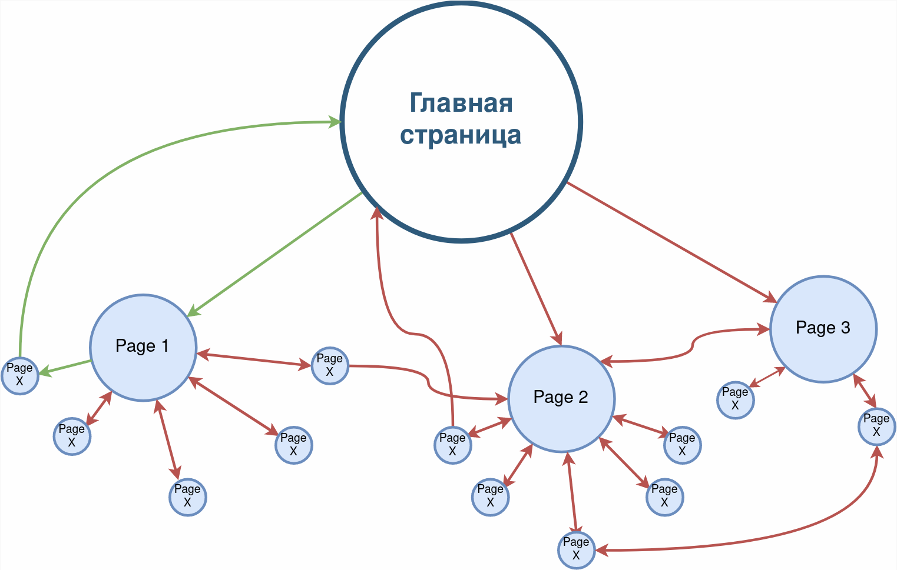

# Site Scrapper

## Описание

В многопоточном режиме формирует карту заданного сайта (список ссылок), и запишите её в файл. 
Ссылки на дочерние страницы должны располагаться в файле с отступами на одну табуляцию относительно родительских.

**Рекомендации**

В файле должны быть ссылки на страницы, размещённые на том же домене (в примере — lenta.ru). 

В списке не должно быть:
- ссылок на другие сайты и поддомены,
- ссылок на внутренние элементы страниц (у таких ссылок есть символ # после адреса страницы).

При запросе страниц нужно выдерживать паузы (с помощью метода sleep() у потока), чтобы сайт не заблокировал доступ вашего приложения. 
Используйте значения от 100 до 150 мс.

Для отладки программы выберите сайт с сотнями или тысячами страниц (например, http://www.lenta.ru/), чтобы сервер вас не заблокировал.

Учитывайте что сайт имеет структуру графа, то есть страницы могут содержать ссылки на главную, на страницы с которой вы пришли по ссылке. 
Исключите возможность циклического перебора ссылок. Пример структуры и ссылок между страниц одного сайта:

зеленым отмечен пример циклического перебора по ссылкам.

**Дополнительные материалы:**

**статьи**

- [baeldung.com/java-fork-join](https://www.baeldung.com/java-fork-join)
- [forkjoin-framework-tutorial-forkjoinpool-example](https://howtodoinjava.com/java7/forkjoin-framework-tutorial-forkjoinpool-example/)

**видео**
- [JUG.ru Алексей Шипилёв — ForkJoinPool в Java 8](https://youtu.be/t0dGLFtRR9c)